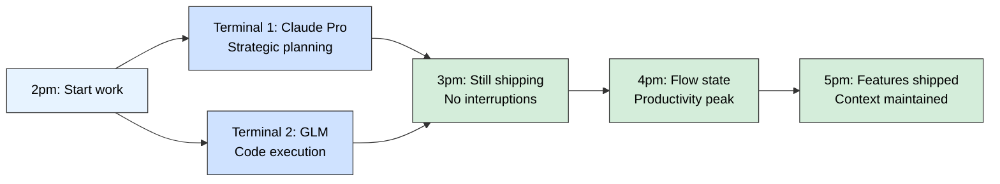

<div align="center">

# CCS - Claude Code Switch


### One command, zero downtime, multiple accounts

**Switch between multiple Claude accounts, GLM, and Kimi instantly.**<br>
Stop hitting rate limits. Keep working continuously.<br>
Features a modern React 19 dashboard with real-time updates.

[](LICENSE)
[]()
[](https://claudekit.cc?ref=HMNKXOHN)

[](https://www.npmjs.com/package/@kaitranntt/ccs)
[](https://react.dev/)
[](https://www.typescriptlang.org/)

**Languages**: [English](README.md) | [Tiếng Việt](docs/vi/README.md) | [日本語](docs/ja/README.md)

</div>

<br>

## Quick Start

### Installation

**npm Package (Recommended)**

**macOS / Linux / Windows**
```bash
npm install -g @kaitranntt/ccs
```

**All major package managers are supported:**

```bash
# yarn
yarn global add @kaitranntt/ccs

# pnpm (70% less disk space)
pnpm add -g @kaitranntt/ccs

# bun (30x faster)
bun add -g @kaitranntt/ccs
```

<details>
<summary><strong>[!] DEPRECATED: Native Shell Installers (Legacy)</strong></summary>

<br>

> [!WARNING]
> **These installers are deprecated and will be removed in a future version.**
> They now auto-redirect to npm installation. Please use npm directly.

**macOS / Linux**
```bash
curl -fsSL ccs.kaitran.ca/install | bash
```

**Windows PowerShell**
```powershell
irm ccs.kaitran.ca/install | iex
```

**Note:** Scripts show deprecation warning and automatically run npm installation if Node.js is available.

</details>

<br>

## Zero-Config OAuth Providers

**New in v5.0.0**: Instant access to premium models with zero API key setup. Browser-based OAuth authentication.

> Powered by [CLIProxyAPI](https://github.com/router-for-me/CLIProxyAPI) - the universal API proxy for AI models.

| Provider | Default Model | Opus | Haiku | Example |
|:---------|:--------------|:-----|:------|:--------|
| **Gemini** | gemini-2.5-pro | gemini-2.5-pro | gemini-2.5-flash | `ccs gemini "explain code"` |
| **Codex** | gpt-5.1-codex-max | gpt-5.1-codex-max-high | gpt-5.1-codex-mini-high | `ccs codex "implement API"` |
| **Antigravity** | gemini-3-pro-preview | gemini-3-pro-preview | gemini-2.5-flash | `ccs agy "review architecture"` |

**First Run**: Browser opens for authentication. Tokens cached in `~/.ccs/cliproxy/auth/<provider>/`.

**Subsequent Runs**: Instant - no re-auth needed until token expires.

### Authentication Commands

```bash
# Interactive OAuth (default) - browser opens, complete auth
ccs gemini

# Authenticate only (save tokens, don't start session)
ccs gemini --auth
ccs codex --auth

# Headless mode (for SSH/servers without browser)
ccs agy --headless       # Displays URL, paste in browser elsewhere

# Logout (clear tokens)
ccs gemini --logout
```

### OAuth vs API Key Models

| Feature | OAuth Providers<br>(gemini, codex, agy) | API Key Models<br>(glm, kimi) |
|:--------|:----------------------------------------|:------------------------------|
| **Setup** | Browser auth on first run | Edit settings.json, add API key |
| **Token Storage** | `~/.ccs/cliproxy/auth/<provider>/` | `~/.ccs/*.settings.json` |
| **Renewal** | Automatic (OAuth refresh tokens) | Manual (update key when expired) |
| **Binary** | Auto-downloads CLIProxyAPI (~15MB) | No additional binaries |
| **Port** | 8317 (configurable) | N/A |
| **Best For** | Quick testing, no key management | Production, explicit key control |

### Troubleshooting OAuth

**OAuth timeout (2min limit)**:
```bash
# If browser doesn't load in time:
ccs gemini --auth --headless   # Get URL manually
```

**Port 8317 conflict**:
```bash
ccs doctor                      # Check port availability
# Error: "Port 8317 in use"
lsof -ti:8317 | xargs kill      # Unix: kill process using port
```

**Binary download failures**:
```bash
ccs doctor                      # Shows binary status + version
# Manual download: https://github.com/router-for-me/CLIProxyAPI/releases
```

<br>

### Configuration (Auto-created)

**CCS automatically creates configuration during installation** (via npm postinstall script).

**~/.ccs/config.json**:
```json
{
  "profiles": {
    "glm": "~/.ccs/glm.settings.json",
    "glmt": "~/.ccs/glmt.settings.json",
    "kimi": "~/.ccs/kimi.settings.json",
    "default": "~/.claude/settings.json"
  }
}
```

<details>
<summary><h3>Custom Claude CLI Path</h3></summary>

<br>

If Claude CLI is installed in a non-standard location (D drive, custom directory), set `CCS_CLAUDE_PATH`:

```bash
export CCS_CLAUDE_PATH="/path/to/claude"              # Unix
$env:CCS_CLAUDE_PATH = "D:\Tools\Claude\claude.exe"   # Windows
```

**See also:** [Troubleshooting Guide](./docs/en/troubleshooting.md#claude-cli-in-non-standard-location) for detailed setup instructions.

</details>

<details>
<summary><h3>Windows Symlink Support (Developer Mode)</h3></summary>

<br>

**Windows users**: Enable Developer Mode for true symlinks (better performance, instant sync):

1. Open **Settings** → **Privacy & Security** → **For developers**
2. Enable **Developer Mode**
3. Reinstall CCS: `npm install -g @kaitranntt/ccs`

**Warning:** Without Developer Mode, CCS automatically falls back to copying directories (works but no instant sync across profiles).

</details>

<br>

### Your First Switch

> [!IMPORTANT]
> **Before using alternative models, update API keys in settings files:**
>
> - **GLM**: Edit `~/.ccs/glm.settings.json` and add your Z.AI Coding Plan API Key
> - **GLMT**: Edit `~/.ccs/glmt.settings.json` and add your Z.AI Coding Plan API Key
> - **Kimi**: Edit `~/.ccs/kimi.settings.json` and add your Kimi API key

<br>

**Parallel Workflow: Planning + Execution**

```bash
# Terminal 1 - Planning (Claude Sonnet)
ccs "Plan a REST API with authentication and rate limiting"

# Terminal 2 - Execution (GLM, cost-optimized)
ccs glm "Implement the user authentication endpoints from the plan"
```

<details>
<summary><strong>Thinking Models (Kimi & GLMT)</strong></summary>

<br>

```bash
# Kimi - Stable thinking support
ccs kimi "Design a caching strategy with trade-off analysis"

# GLMT - Experimental (see full disclaimer below)
ccs glmt "Debug complex algorithm with reasoning steps"
```

**Note:** GLMT is experimental and unstable. See [GLM with Thinking (GLMT)](#glm-with-thinking-glmt) section below for full details.

</details>

<br>

## The Daily Developer Pain Point

<div align="center">

### **STOP Switching. START Orchestrating.**

**Session limits shouldn't kill your flow state.**
</div>

You're deep in implementation. Context loaded. Solution crystallizing.<br>
Then: 🔴 _"You've reached your usage limit."_

**Momentum gone. Context lost. Productivity crater.**

## **The Solution: Parallel Workflows**

<details>
<summary><strong>❌ OLD WAY:</strong> Switch When You Hit Limits (Reactive)</summary>

<br>


**Result:** 1 hour lost, momentum destroyed, frustration builds

</details>

<details open>
<summary><strong>✨ NEW WAY:</strong> Run Parallel From Start (Proactive) - <strong>RECOMMENDED</strong></summary>

<br>



**Result:** Zero downtime, continuous productivity, less frustration

### 💰 **The Value Proposition:**
- **Setup:** Your existing Claude Pro + GLM Lite (cost-effective add-on)
- **Value:** Save 1 hour/day × 20 workdays = 20 hours/month recovered
- **ROI:** Your development time is worth more than the setup cost
- **Reality:** Shipping faster than the overhead

</details>

## Choose Your Path

<details>
<summary><strong>Budget-Focused:</strong> GLM Only</summary>

- **Best for:** Cost-conscious development, basic code generation
- **Usage:** Just use `ccs glm` directly for cost-effective AI assistance
- **Reality:** No Claude access, but capable for many coding tasks
- **Setup:** GLM API key only, very affordable

</details>

<details open>
<summary><strong>✨ Recommended for Daily Development:</strong> 1 Claude Pro + 1 GLM Lite</summary>

- **Best for:** Daily code delivery, serious development work
- **Usage:** `ccs` for planning + `ccs glm` for execution (parallel workflow)
- **Reality:** Perfect balance of capability and cost for most developers
- **Value:** Never hit session limits, continuous productivity

</details>

<details>
<summary><strong>Power User:</strong> Multiple Claude Pro + GLM Pro</summary>

- **Best for:** Heavy workloads, concurrent projects, solo dev
- **Unlocks:** Never drain session or weekly limits
- **Workflow:** 3+ terminals running specialized tasks simultaneously

</details>

<details>
<summary><strong>Privacy-Focused:</strong> Work/Personal Isolation</summary>

- **When needed:** Strict separation of work and personal AI contexts
- **Setup:** `ccs auth create work` + `ccs auth create personal`
- **Note:** Advanced feature - most users don't need this

</details>

---

## Why CCS Instead of Manual Switching?

<div align="center">

**CCS isn't about "switching when you hit limits at 3pm."**

## **It's about running in parallel from the start.**

</div>

### The Core Difference

| **Manual Switching** | **CCS Orchestration** |
|:---|:---|
| 🔴 Hit limits → Stop work → Edit config files → Restart | ✅ Multiple terminals running different models from the start |
| 😰 Context loss and flow state interruption | 😌 Continuous productivity with preserved context |
| 📝 Sequential task handling | ⚡ Parallel workflows (planning + execution simultaneously) |
| 🛠️ Reactive problem solving when blocked | 🎯 Proactive workflow design prevents blocks |

### What CCS Gives You

- **Zero Context Switching**: Keep your flow state without interruption
- **Parallel Productivity**: Strategic planning in one terminal, code execution in another
- **Instant Account Management**: One command switches, no config file editing
- **Work-Life Separation**: Isolate contexts without logging out
- **Cross-Platform Consistency**: Same smooth experience on macOS, Linux, Windows

**Manual context switching breaks workflow. CCS orchestrates seamlessly.**

<br>

## Architecture

CCS resolves profiles in priority order:
1. **CLIProxy profiles** (gemini, codex, agy) - OAuth-based, zero config
2. **CLIProxy variants** (user-defined) - Custom model settings for CLIProxy providers
3. **Settings-based profiles** (glm, kimi) - API key required
4. **Account-based profiles** (work, personal) - Isolated Claude instances
5. **Default** - Claude CLI with subscription

### Profile Types

**CLIProxy**: gemini, codex, agy (v5.0+)
- OAuth-based authentication via [CLIProxyAPI](https://github.com/router-for-me/CLIProxyAPI)
- Browser auth on first run, tokens cached in `~/.ccs/cliproxy/auth/<provider>/`
- Proxy runs on port 8317, auto-spawned per session
- Binary: `~/.ccs/cliproxy/bin/cli-proxy-api` (~15MB, auto-downloaded)
- Model mappings:
  - **Gemini**: gemini-2.5-pro (opus), gemini-2.0-flash (sonnet), flash-lite (haiku)
  - **Codex**: gpt-5.1-codex-max (opus), gpt-4o (sonnet), gpt-4o-mini (haiku)
  - **Antigravity**: agy-pro (sonnet), agy-turbo (haiku)

**CLIProxy Variants** (v5.0.2+)
- User-defined profile names that route through CLIProxy providers
- Allows multiple model configurations per provider (e.g., `flash` and `pro` for Gemini)
- Configure in `~/.ccs/config.json` under `cliproxy` section:

```json
{
  "profiles": { ... },
  "cliproxy": {
    "flash": { "provider": "gemini", "settings": "~/.ccs/gemini-flash.settings.json" },
    "pro": { "provider": "gemini", "settings": "~/.ccs/gemini-pro.settings.json" },
    "gpt": { "provider": "codex", "settings": "~/.ccs/codex-gpt.settings.json" }
  }
}
```

Usage: `ccs flash "quick task"` or `ccs pro "complex analysis"`

Settings file format (`~/.ccs/gemini-flash.settings.json`):

```json
{
  "env": {
    "ANTHROPIC_BASE_URL": "http://127.0.0.1:8317/api/provider/gemini",
    "ANTHROPIC_AUTH_TOKEN": "ccs-internal-managed",
    "ANTHROPIC_MODEL": "gemini-2.5-flash",
    "ANTHROPIC_DEFAULT_OPUS_MODEL": "gemini-2.5-flash",
    "ANTHROPIC_DEFAULT_SONNET_MODEL": "gemini-2.5-flash",
    "ANTHROPIC_DEFAULT_HAIKU_MODEL": "gemini-2.5-flash"
  }
}
```

> [!TIP]
> Copy from `~/.ccs/gemini.settings.json` (auto-generated on first `ccs gemini` run) and modify `ANTHROPIC_MODEL` to your desired model.

**Settings-based**: GLM, GLMT, Kimi, default
- Uses `--settings` flag pointing to config files
- GLMT: Embedded proxy for thinking mode support

**Account-based**: work, personal, team
- Uses `CLAUDE_CONFIG_DIR` for isolated instances
- Create with `ccs auth create <profile>`

### Shared Data (v4.4+)

**Shared across instances** (`~/.ccs/shared/` symlinked to `~/.claude/`):
- commands/ - Slash commands
- skills/ - Agent skills
- agents/ - Agent configs
- **settings.json** - Claude CLI settings (v4.4+)

**Profile-specific**:
- sessions/ - Conversation history
- todolists/ - Todo lists
- logs/ - Execution logs
- **cliproxy/auth/** - OAuth tokens (CLIProxy profiles only)

> [!NOTE]
> **v4.4 Breaking Change**: settings.json now shared across profiles. Previously each profile had isolated settings. Migration is automatic on install using ~/.claude/settings.json as the authoritative source. Backups created: `<instance>/settings.json.pre-shared-migration`

> [!NOTE]
> **Windows**: Symlink support requires Developer Mode (v4.2 will add copy fallback)

<br>

## Web Dashboard

CCS includes a modern React 19 dashboard for visual profile management and real-time monitoring:

```bash
# Start the web dashboard (auto-detects available port)
ccs config

# Or specify a port
ccs config --port 3000

# Access at http://localhost:PORT (shown in output)
```

**Dashboard Features**:
- 🎨 **Modern UI**: Built with React 19, TypeScript, and shadcn/ui
- 📊 **Real-time Updates**: WebSocket integration for live status
- ⚙️ **Profile Management**: Visual configuration of all profiles
- 🔍 **Health Monitoring**: System diagnostics and metrics
- 🌙 **Dark Mode**: Eye-friendly theme switching
- 📱 **Responsive**: Works on desktop and mobile

### Dashboard Screenshots

*(Add screenshots here when available)*

## Usage Examples

### Basic Switching

```bash
ccs              # Claude subscription (default)
ccs glm          # GLM (cost-optimized)
ccs kimi         # Kimi (with thinking support)
```

### Multi-Account Setup

```bash
# Create accounts
ccs auth create work
ccs auth create personal
```

**Run concurrently in separate terminals:**

```bash
# Terminal 1 - Work
ccs work "implement feature"

# Terminal 2 - Personal (concurrent)
ccs personal "review code"
```

### Help & Version

```bash
ccs --version    # Show version
ccs --help       # Show all commands and options
```

<br>

## AI-Powered Delegation

> [!TIP]
> **New in v4.0**: Delegate tasks to cost-optimized models (GLM, Kimi) directly from your main Claude session. Save 81% on simple tasks with real-time visibility.

### What is Delegation?

CCS Delegation lets you **send tasks to alternative models** (`glm`, `kimi`) **from your main Claude session** using the `-p` flag or intelligent slash commands (`/ccs`, `/ccs:continue`).

**Why use it?**
- **Token efficiency**: Simple tasks cost 81% less on GLM vs main Claude session
- **Context preservation**: Main session stays clean, no pollution from mechanical tasks
- **Real-time visibility**: See tool usage as tasks execute (`[Tool] Write: index.html`)
- **Multi-turn support**: Resume sessions with `:continue` for iterative work

### Quick Examples

**Direct CLI:**
```bash
# Delegate simple task to GLM (cost-optimized)
ccs glm -p "add tests for UserService"

# Delegate long-context task to Kimi
ccs kimi -p "analyze all files in src/ and document architecture"

# Continue previous session
ccs glm:continue -p "run the tests and fix any failures"
```

**Via Slash Commands** (inside Claude sessions):
```bash
# In your main Claude session:
/ccs "refactor auth.js to use async/await"           # Auto-selects best profile
/ccs --glm "fix typo in documentation"               # Forces GLM profile
/ccs --kimi "analyze entire architecture"            # Forces Kimi profile
/ccs:continue "also update the README examples"      # Continues last session
```

**Via Natural Language** (Claude auto-delegates):
```bash
# Claude detects delegation patterns and auto-executes:
"Use ccs glm to add tests for all *.service.js files"
"Delegate to kimi: analyze project structure"
```

### Real-Time Output

See exactly what's happening as tasks execute:

```
$ ccs glm -p "/cook create a landing page"
[i] Delegating to GLM-4.6...
[Tool] Write: /home/user/project/index.html
[Tool] Write: /home/user/project/styles.css
[Tool] Write: /home/user/project/script.js
[Tool] Edit: /home/user/project/styles.css
[i] Execution completed in 45.2s

╔══════════════════════════════════════════════════════╗
║ Working Directory: /home/user/project               ║
║ Model: GLM-4.6                                       ║
║ Duration: 45.2s                                      ║
║ Exit Code: 0                                         ║
║ Session ID: 3a4f8c21                                 ║
║ Total Cost: $0.0015                                  ║
║ Turns: 3                                             ║
╚══════════════════════════════════════════════════════╝
```

### Advanced Features

**Slash Command Support:**
Delegation preserves custom slash commands in prompts:
```bash
ccs glm -p "/cook create responsive landing page"
# Executes /cook command in delegated GLM session
```

**Signal Handling:**
Ctrl+C or Esc properly kills delegated processes (no orphans):
```bash
# Hit Ctrl+C during delegation
[!] Parent process terminating, killing delegated session...
```

**Time-Based Limits:**
10-minute default timeout with graceful termination (supports `:continue`):
```bash
ccs glm -p "complex task"  # Auto-terminates after 10min if needed
ccs glm:continue -p "pick up where we left off"
```

### Cost Savings Example

**Traditional (Main Session):**
```
Context load: 2000 tokens
Discussion:   1500 tokens
Code gen:     4500 tokens
─────────────────────────
Total:        8000 tokens → $0.032
```

**Delegation (GLM):**
```
3x tasks via GLM: 1500 tokens → $0.0045
─────────────────────────────────────────
Savings:                        $0.0275 (86% reduction)
```

### Documentation

- **Workflow Diagrams**: See [docs/ccs-delegation-diagrams.md](docs/ccs-delegation-diagrams.md) for visual architecture
- **Skill Reference**: `.claude/skills/ccs-delegation/` for AI decision framework (replaces deprecated agents)
- **Agent Docs**: `.claude/agents/ccs-delegator.md` was deprecated in v4.3.2, functionality moved to ccs-delegation skill

<br>

## GLM with Thinking (GLMT)

> [!CAUTION]
> ### NOT PRODUCTION READY - EXPERIMENTAL FEATURE
>
> **GLMT is experimental and requires extensive debugging**:
> - Streaming and tool support still under active development
> - May experience unexpected errors, timeouts, or incomplete responses
> - Requires frequent debugging and manual intervention
> - **Not recommended for critical workflows or production use**
>
> **Alternative for GLM Thinking**: Consider going through the **CCR hustle** with the **Transformer of Bedolla** ([ZaiTransformer](https://github.com/Bedolla/ZaiTransformer/)) for a more stable implementation.

> [!IMPORTANT]
> GLMT requires npm installation (`npm install -g @kaitranntt/ccs`). Not available in native shell versions (requires Node.js HTTP server).

<br>

> [!NOTE]
> ### Acknowledgments: The Foundation That Made GLMT Possible
>
> **CCS's GLMT implementation owes its existence to the groundbreaking work of [@Bedolla](https://github.com/Bedolla)**, who created [ZaiTransformer](https://github.com/Bedolla/ZaiTransformer/) - the **first integration** to bridge [Claude Code Router (CCR)](https://github.com/musistudio/claude-code-router) with Z.AI's reasoning capabilities.
>
> **Why this matters**: Before ZaiTransformer, no one had successfully integrated Z.AI's thinking mode with Claude Code's workflow. Bedolla's work wasn't just helpful - it was **foundational**. His implementation of:
>
> - **Request/response transformation architecture** - The conceptual blueprint for how to bridge Anthropic and OpenAI formats
> - **Thinking mode control mechanisms** - The patterns for managing reasoning_content delivery
> - **Embedded proxy design** - The architecture that CCS's GLMT proxy is built upon
>
> These contributions directly inspired and enabled GLMT's design. **Without ZaiTransformer's pioneering work, GLMT wouldn't exist in its current form**. The technical patterns, transformation logic, and proxy architecture implemented in CCS are a direct evolution of the concepts Bedolla first proved viable.
>
> **Recognition**: If you benefit from GLMT's thinking capabilities, you're benefiting from Bedolla's vision and engineering. Please consider starring [ZaiTransformer](https://github.com/Bedolla/ZaiTransformer/) to support pioneering work in the Claude Code ecosystem.

<br>

<details>
<summary><h3>GLM vs GLMT Comparison</h3></summary>

<br>

<div align="center">

| Feature | GLM (`ccs glm`) | GLMT (`ccs glmt`) |
|:--------|:----------------|:------------------|
| **Endpoint** | Anthropic-compatible | OpenAI-compatible |
| **Thinking** | No | Experimental (`reasoning_content`) |
| **Tool Support** | Basic | **Unstable (v3.5+)** |
| **MCP Tools** | Limited | **Buggy (v3.5+)** |
| **Streaming** | Stable | **Experimental (v3.4+)** |
| **TTFB** | <500ms | <500ms (sometimes), 2-10s+ (often) |
| **Use Case** | Reliable work | **Debugging experiments only** |

</div>

</details>

<details>
<summary><h3>Tool Support (v3.5) - EXPERIMENTAL</h3></summary>

<br>

**GLMT attempts MCP tools and function calling:**

- **Bidirectional Transformation**: Anthropic tools ↔ OpenAI format (unstable)
- **MCP Integration**: MCP tools sometimes execute (often output XML garbage)
- **Streaming Tool Calls**: Real-time tool calls (when not crashing)
- **Backward Compatible**: May break existing thinking support
- **Configuration Required**: Frequent manual debugging needed

</details>

<details>
<summary><h3>Streaming Support (v3.4) - OFTEN FAILS</h3></summary>

<br>

**GLMT attempts real-time streaming** with incremental reasoning content delivery:

- **Default**: Streaming enabled (TTFB <500ms when it works)
- **Auto-fallback**: Frequently switches to buffered mode due to errors
- **Thinking parameter**: Claude CLI `thinking` parameter sometimes works
  - May ignore `thinking.type` and `budget_tokens`
  - Precedence: CLI parameter > message tags > default (when not broken)

**Status**: Z.AI (tested, tool calls frequently break, requires constant debugging)

</details>

<details>
<summary><h3>How It Works (When It Works)</h3></summary>

<br>

1. CCS spawns embedded HTTP proxy on localhost (if not crashing)
2. Proxy attempts to convert Anthropic format → OpenAI format (often fails)
3. Tries to transform Anthropic tools → OpenAI function calling format (buggy)
4. Forwards to Z.AI with reasoning parameters and tools (when not timing out)
5. Attempts to convert `reasoning_content` → thinking blocks (partial or broken)
6. Attempts to convert OpenAI `tool_calls` → Anthropic `tool_use` blocks (XML garbage common)
7. Thinking and tool calls sometimes appear in Claude Code UI (when not broken)

</details>

<details>
<summary><h3>Control Tags & Keywords</h3></summary>

<br>

**Control Tags**:
- `<Thinking:On|Off>` - Enable/disable reasoning blocks (default: On)
- `<Effort:Low|Medium|High>` - Control reasoning depth (deprecated - Z.AI only supports binary thinking)

**Thinking Keywords** (inconsistent activation):
- `think` - Sometimes enables reasoning (low effort)
- `think hard` - Sometimes enables reasoning (medium effort)
- `think harder` - Sometimes enables reasoning (high effort)
- `ultrathink` - Attempts maximum reasoning depth (often breaks)

</details>

<details>
<summary><h3>Environment Variables</h3></summary>

<br>

**GLMT features** (all experimental):
- Forced English output enforcement (sometimes works)
- Random thinking mode activation (unpredictable)
- Attempted streaming with frequent fallback to buffered mode

**General**:
- `CCS_DEBUG_LOG=1` - Enable debug file logging
- `CCS_CLAUDE_PATH=/path/to/claude` - Custom Claude CLI path

</details>

<details>
<summary><h3>API Key Setup</h3></summary>

<br>

```bash
# Edit GLMT settings
nano ~/.ccs/glmt.settings.json
```

Set Z.AI API key (requires coding plan):

```json
{
  "env": {
    "ANTHROPIC_AUTH_TOKEN": "your-z-ai-api-key"
  }
}
```

</details>

<details>
<summary><h3>Security Limits (DoS Protection)</h3></summary>

<br>

**v3.4 Protection Limits**:

| Limit | Value | Purpose |
|:------|:------|:--------|
| **SSE buffer** | 1MB max per event | Prevent buffer overflow |
| **Content buffer** | 10MB max per block | Limit thinking/text blocks |
| **Content blocks** | 100 max per message | Prevent DoS attacks |
| **Request timeout** | 120s | Both streaming and buffered |

</details>

<details>
<summary><h3>Debugging</h3></summary>

<br>

**Enable verbose logging**:
```bash
ccs glmt --verbose "your prompt"
```

**Enable debug file logging**:
```bash
export CCS_DEBUG_LOG=1
ccs glmt --verbose "your prompt"
# Logs: ~/.ccs/logs/
```

**GLMT debugging**:
```bash
# Verbose logging shows streaming status and reasoning details
ccs glmt --verbose "test"
```

**Check reasoning content**:
```bash
cat ~/.ccs/logs/*response-openai.json | jq '.choices[0].message.reasoning_content'
```

**Troubleshooting**:
- **If absent**: Z.AI API issue (verify key, account status)
- **If present**: Transformation issue (check `response-anthropic.json`)

</details>

<br>

## Maintenance

### Health Check

Run diagnostics to verify your CCS installation:

```bash
ccs doctor
```

**Checks performed**:
- ✓ Claude CLI availability
- ✓ Configuration files (config.json, profiles)
- ✓ CCS symlinks to ~/.claude/
- ✓ Delegation system
- ✓ File permissions

**Output**:
```
[?] Checking Claude CLI... [OK]
[?] Checking ~/.ccs/ directory... [OK]
[?] Checking config.json... [OK]
[?] Checking CCS symlinks... [OK]
...
Status: Installation healthy
```

### Updating CCS

```bash
# Update to latest stable version
ccs update

# Force reinstall (fix corrupted installation)
ccs update --force

# Install beta/dev channel (unstable, for testing)
ccs update --beta

# Force reinstall from dev channel
ccs update --force --beta
```

**Note:** `--beta` installs from the `@dev` npm tag, which contains unreleased features. Not recommended for production use.

### Update CCS Items

If you modify CCS items or need to re-install symlinks:

```bash
ccs sync
```

**What it does**:
- Re-creates selective symlinks from `~/.ccs/.claude/` to `~/.claude/`
- Backs up existing files before replacing
- Safe to run multiple times (idempotent)

**When to use**:
- After manual modifications to ~/.claude/
- If `ccs doctor` reports symlink issues
- After upgrading CCS to a new version

<br>

### Troubleshooting

#### Broken Installation

If CCS is corrupted or behaving unexpectedly:

```bash
# Force reinstall to fix
ccs update --force
```

If that doesn't work, try manual reinstall:

```bash
npm install -g @kaitranntt/ccs@latest --force
```

#### Beta Testing Issues

If you're on the dev channel and experiencing issues:

```bash
# Return to stable channel
ccs update
```

#### Common Issues

- **Update fails**: Check network connection and try `ccs update --force`
- **Beta not working**: Use `ccs update` to return to stable version
- **Direct install error**: Beta channel requires npm installation

For detailed troubleshooting, see [Troubleshooting Guide](./docs/en/troubleshooting.md).

<br>

## Uninstall

### npm (Recommended)

```bash
npm uninstall -g @kaitranntt/ccs
```

<details>
<summary><strong>Alternative Package Managers</strong></summary>

<br>

```bash
# yarn
yarn global remove @kaitranntt/ccs

# pnpm
pnpm remove -g @kaitranntt/ccs

# bun
bun remove -g @kaitranntt/ccs
```

</details>

<details>
<summary><strong>Legacy Uninstallers (for native installs)</strong></summary>

<br>

```bash
# macOS / Linux
curl -fsSL ccs.kaitran.ca/uninstall | bash

# Windows PowerShell
irm ccs.kaitran.ca/uninstall | iex
```

</details>

<br>

## 🎯 Philosophy

- **YAGNI**: No features "just in case"
- **KISS**: Simple bash, no complexity
- **DRY**: One source of truth (config)

## 📖 Documentation

**Complete documentation in [docs/](./docs/)**:
- [Installation Guide](./docs/en/installation.md)
- [Configuration](./docs/en/configuration.md)
- [Usage Examples](./docs/en/usage.md)
- [System Architecture](./docs/system-architecture.md)
- [GLMT Control Mechanisms](./docs/glmt-controls.md)
- [Troubleshooting](./docs/en/troubleshooting.md)
- [Contributing](./CONTRIBUTING.md)

## 🤝 Contributing

We welcome contributions! Please see our [Contributing Guide](./CONTRIBUTING.md) for details.


## Star History

<div align="center">


</div>


## License

CCS is licensed under the [MIT License](LICENSE).

<div align="center">

**Made with ❤️ for developers who hit rate limits too often**

[⭐ Star this repo](https://github.com/kaitranntt/ccs) | [🐛 Report issues](https://github.com/kaitranntt/ccs/issues) | [📖 Read docs](./docs/en/)

</div>
