# CCS Project Roadmap

## Project Overview

CCS (Claude Code Switch) is a TypeScript-based CLI tool with a modern React 19 dashboard for instant switching between multiple AI models (Claude Sonnet 4.5, GLM 4.6, GLMT, Kimi). The project features real-time WebSocket integration, comprehensive profile management, and cross-platform support. It enables developers to maintain continuous productivity by running parallel workflows with different AI models, avoiding rate limits and context switching.

### Core Value Proposition
- **Zero Downtime**: Instant profile switching without breaking flow state
- **Modern UI**: React 19 dashboard with real-time updates and WebSocket integration
- **Cost Optimization**: 81% cost savings through intelligent delegation to GLM/Kimi
- **Parallel Workflows**: Strategic planning with Claude + cost-effective execution with GLM
- **Cross-Platform**: Unified experience on macOS, Linux, and Windows
- **Type Safety**: 100% TypeScript coverage with zero `any` types

## Current Status

### Version Information
- **Current Version**: 4.5.0 (React Dashboard Integration Complete)
- **Release Status**: Production-ready with modern React UI
- **Build Status**: ✅ Working (npm run build → dist/ccs.js)
- **UI Build Status**: ✅ Working (cd ui && bun run build → dist/)
- **Test Status**: ✅ All tests passing (39/39 tests)
- **Cross-Platform**: ✅ Windows/macOS/Linux
- **Code Quality**: ✅ ESLint strictness upgrade completed
- **Code Architecture**: ✅ TypeScript-based with modular components
- **React Dashboard**: ✅ Full React 19 integration with Vite and shadcn/ui
- **Real-time Features**: ✅ WebSocket integration for live updates

### React Dashboard Integration (v4.5.0)

**✅ Complete Modern UI Implementation**

CCS now features a comprehensive React 19 dashboard providing a modern web interface for profile management and system monitoring.

**Technology Stack**:
- **React 19**: Latest version with concurrent features and hooks
- **TypeScript**: Full type safety across the entire UI codebase
- **Vite**: Fast build tool with HMR and optimized production builds
- **shadcn/ui**: Modern component library built on Radix UI primitives
- **TanStack Query**: Powerful server state management with caching
- **Tailwind CSS**: Utility-first styling for rapid development

**Dashboard Features**:
- ✅ **Real-time Updates**: WebSocket integration for live profile status
- ✅ **Profile Management**: Visual configuration of API profiles (GLM, GLMT, Kimi)
- ✅ **CLIProxy Integration**: OAuth provider setup and management
- ✅ **Account Management**: Multi-account profile switching
- ✅ **Health Monitoring**: System diagnostics dashboard
- ✅ **Settings Panel**: Global configuration interface
- ✅ **Dark Mode**: Theme switching support
- ✅ **Responsive Design**: Mobile-friendly interface

**Technical Implementation**:
- **163 Total Files**: Comprehensive codebase with modular architecture
- **~8,000 Lines**: Well-organized TypeScript code
- **Component Library**: Reusable UI components with consistent design
- **API Integration**: Seamless backend communication
- **Build Optimization**: Code splitting and lazy loading
- **Accessibility**: WCAG-compliant components

### TypeScript Conversion Summary

**✅ Conversion Completed: 100% (43 files)**

The CCS project has been fully converted from JavaScript to TypeScript, delivering enhanced type safety, improved developer experience, and better maintainability.

**Migration Statistics**:
- **Source Files**: 43 TypeScript files converted
- **Lines of Code**: ~8,000 lines of TypeScript code
- **Type Coverage**: 100% with zero `any` types
- **Build System**: Full TypeScript compilation pipeline
- **Type Definitions**: Comprehensive type definitions in `src/types/`

**Converted Components**:
- ✅ **Core System** (`src/ccs.ts`) - Main entry point
- ✅ **Commands** (`src/commands/`) - Modular command handlers
- ✅ **Authentication** (`src/auth/`) - Profile management and commands
- ✅ **CLIProxy** (`src/cliproxy/`) - OAuth provider integration
- ✅ **Delegation** (`src/delegation/`) - AI-powered task delegation system
- ✅ **GLMT** (`src/glmt/`) - GLM with Thinking support
- ✅ **Management** (`src/management/`) - System diagnostics and instance management
- ✅ **Utils** (`src/utils/`) - Cross-platform utilities and helpers
- ✅ **Types** (`src/types/`) - Complete type definitions

## Recent Achievements

### TypeScript Conversion Benefits (v4.4.0)

#### Type Safety & Reliability
- **Zero `any` types**: Complete type coverage across the entire codebase
- **Compile-time error detection**: Catches bugs before runtime
- **Interface contracts**: Clear API boundaries and data structures
- **Exhaustive type checking**: Eliminates entire classes of common errors

#### Enhanced Developer Experience
- **IDE support**: Full IntelliSense autocomplete and navigation
- **Refactoring safety**: Type-safe code modifications and renames
- **Self-documenting code**: Type definitions serve as living documentation
- **Better debugging**: Clear type information in debuggers and stack traces

#### Maintainability Improvements
- **Code navigation**: Easy "go to definition" across the entire codebase
- **Impact analysis**: Clear understanding of where types are used
- **API documentation**: Types define precise interfaces for all components
- **Future-proofing**: Easier to add new features without breaking existing code

#### Architecture Enhancements
- **Modular type system**: Comprehensive type definitions in `src/types/`
- **Strict configuration**: TypeScript strict mode enabled for maximum safety
- **Build pipeline**: Automated compilation with source maps and declarations
- **Cross-platform consistency**: Types ensure consistent behavior across platforms

### Phase 01: ESLint Strictness Upgrade Complete ✅

**Completion Date**: 2025-11-27
**Status**: SUCCESS - All quality gates passing

#### Enhanced Code Quality Standards

**ESLint Rules Upgraded** (`eslint.config.mjs`):
- ✅ `@typescript-eslint/no-unused-vars`: `warn` → `error`
- ✅ `@typescript-eslint/no-explicit-any`: `warn` → `error`
- ✅ `@typescript-eslint/no-non-null-assertion`: `warn` → `error`

#### Validation Results
- **TypeScript Compilation**: ✅ Zero type errors
- **ESLint Validation**: ✅ Zero violations (previously 3 warning rules)
- **Test Suite**: ✅ 39/39 tests passing
- **Manual Testing**: ✅ All critical commands working
- **Code Coverage**: ✅ 10,487 lines of TypeScript code analyzed

#### Quality Improvements Achieved
1. **Type Safety Enhancement**: Zero tolerance for unused variables, explicit any types, and non-null assertions
2. **Code Quality Enforcement**: Stricter linting prevents entire categories of potential bugs
3. **Maintainability Boost**: Cleaner, more predictable codebase with enforced standards
4. **Zero Breaking Changes**: All functionality preserved, enhanced reliability only

#### Next Phase Readiness
- **Phase 02 Status**: ✅ COMPLETED (2025-11-27)
- **Focus**: CCS monolithic split (ccs.ts 1071 lines → 593 lines, 44.6% reduction)
- **Goal**: ✅ Achieved - 7 modular command handlers created for improved maintainability
- **Results**: All validation gates pass, code review: EXCELLENT

**Phase 03 Status**: ✅ COMPLETED (2025-12-03)
- **Focus**: Beta channel implementation with npm tag switching
- **Goal**: ✅ Achieved - Full beta channel support with stability warnings
- **Results**: All validation gates pass, comprehensive user guidance implemented

### Phase 02: CCS Split Refactoring Complete ✅

**Completion Date**: 2025-11-27
**Status**: SUCCESS - All objectives achieved

### Phase 03: Beta Channel Implementation Complete ✅

**Completion Date**: 2025-12-03
**Status**: SUCCESS - Beta channel fully implemented

#### Beta Channel Features Delivered

**NPM Tag Switching System**:
- ✅ Implemented `fetchVersionFromNpmTag()` function for tag-specific version queries
- ✅ Added support for `@latest` and `@dev` npm tags
- ✅ Seamless switching between stable and beta channels

**Enhanced Update Command**:
- ✅ `--beta` flag implementation with target tag detection
- ✅ Stability warnings for beta channel installations:
  - "[!] Installing from @dev channel (unstable)"
  - "[!] Not recommended for production use"
  - "[!] Use `ccs update` (without --beta) to return to stable"
- ✅ Combined flag support: `--force --beta` for force reinstall from beta

**Installation Method Validation**:
- ✅ npm installations: Full beta channel support
- ✅ Direct installer installations: Clear error messages with migration guidance
- ✅ Automatic detection of installation method
- ✅ Graceful fallback to stable channel for unsupported methods

#### Technical Implementation Details

**Core Changes**:
- `src/utils/update-checker.ts`: Added `fetchVersionFromNpmTag()` and targetTag parameter
- `src/commands/update-command.ts`: Enhanced with beta flag parsing and validation
- `src/ccs.ts`: Updated to pass beta flag to update handler

**User Experience Improvements**:
- Clear warnings about beta channel stability
- One-command return to stable channel
- Helpful error messages with migration instructions
- Seamless channel switching without data loss

#### Validation Results
- **TypeScript Compilation**: ✅ Zero type errors
- **ESLint Validation**: ✅ Zero violations
- **Manual Testing**: ✅ All beta channel scenarios working
- **Error Handling**: ✅ Comprehensive error messages for edge cases
- **Documentation**: ✅ Updated across all relevant files

#### Modular Command Architecture Implementation

**Command Handler Modules Created:**
- ✅ `src/commands/version-command.ts` (3.0KB) - Version display functionality
- ✅ `src/commands/help-command.ts` (4.9KB) - Comprehensive help system
- ✅ `src/commands/install-command.ts` (957B) - Install/uninstall operations
- ✅ `src/commands/doctor-command.ts` (415B) - System diagnostics
- ✅ `src/commands/sync-command.ts` (1.0KB) - Configuration synchronization
- ✅ `src/commands/shell-completion-command.ts` (2.1KB) - Shell completion management

**New Utility Modules:**
- ✅ `src/utils/shell-executor.ts` (1.5KB) - Cross-platform shell execution
- ✅ `src/utils/package-manager-detector.ts` (3.8KB) - Package manager detection

#### Refactoring Metrics Achieved

**File Size Reduction:**
- **src/ccs.ts**: 1,071 → 593 lines (**44.6% reduction**)
- **Main file focus**: Now contains only routing logic + profile detection + GLMT proxy
- **Maintainability**: Enhanced through modular command separation

**Code Organization:**
- **Before**: 1 monolithic file handling all commands
- **After**: 7 focused command handlers + 2 utility modules
- **Benefits**: Easier testing, better code navigation, focused responsibilities

#### Architecture Improvements

**Enhanced Modularity:**
- **Command Handlers**: Each command isolated in dedicated module
- **Utility Functions**: Cross-platform shell execution and package management
- **Clean Separation**: Main file focuses on orchestration only
- **Type Safety**: All new modules maintain 100% TypeScript compliance

**Maintainability Benefits:**
- **Single Responsibility**: Each module has focused purpose
- **Easy Testing**: Command handlers can be tested independently
- **Code Navigation**: Developers can quickly locate specific functionality
- **Future Enhancements**: New commands can be added without touching main file

#### Validation Results
- **TypeScript Compilation**: ✅ Zero type errors
- **ESLint Validation**: ✅ Zero violations
- **Test Suite**: ✅ All tests passing
- **Functionality**: ✅ 100% feature preservation
- **Performance**: ✅ No degradation, minor improvement due to smaller main file

#### Code Quality Assessment
- **Review Status**: EXCELLENT
- **Architecture**: Clean modular design
- **Type Safety**: Comprehensive TypeScript coverage
- **Documentation**: Well-documented interfaces and functions
- **Future-Proofing**: Scalable architecture for additional commands

### Configuration Architecture Improvements
- **Shared Settings**: v4.4 introduces unified `settings.json` sharing across profiles
- **Plugin Support**: Enhanced shared directory structure with plugin support
- **Error Handling**: Improved error management with typed error codes
- **Shell Completion**: PowerShell compatibility improvements

### Phase 05: Bootstrap Passthrough Verification Complete ✅

**Completion Date**: 2025-12-03 16:40
**Status**: SUCCESS - Bootstrap scripts handle argument passthrough correctly

#### Implementation Summary

The bootstrap script verification phase confirmed that both Unix and Windows bootstrap scripts already correctly pass all command-line arguments to the Node.js implementation. No code changes were required.

#### Technical Verification

**Bash Bootstrap (`lib/ccs`)**:
- Line 32: `exec npx "$PACKAGE" "$@"`
- `"$@"` correctly expands to all positional parameters, preserving quotes
- Successfully passes `--force`, `--beta`, and combined flags

**PowerShell Bootstrap (`lib/ccs.ps1`)**:
- Lines 5-8: Parameter capture with `ValueFromRemainingArguments=$true`
- Line 38: `& npx $PACKAGE @RemainingArgs`
- `@RemainingArgs` uses splatting to pass all captured arguments
- Successfully passes `--force`, `--beta`, and combined flags

#### Key Achievements

1. **Zero Code Changes**: Existing implementation already supports new flags
2. **Cross-Platform Consistency**: Both Unix and Windows handle arguments identically
3. **No Breaking Changes**: Existing functionality remains unaffected
4. **Security Preserved**: Arguments passed through without shell expansion risks

#### Validation Results

- **Argument Passthrough**: ✅ `--force` flag reaches Node.js implementation
- **Beta Support**: ✅ `--beta` flag reaches Node.js implementation
- **Combined Flags**: ✅ `--force --beta` combination works correctly
- **Existing Commands**: ✅ All existing commands continue to work
- **Error Handling**: ✅ Invalid flags properly rejected by Node.js layer

#### Next Steps

Ready to proceed with:
- Phase 06: Comprehensive test suite implementation
- Phase 07: Documentation updates for new features

## Current Architecture

### Updated Architecture Diagram

```mermaid
%%{init: {'theme': 'base', 'themeVariables': { 'primaryColor': '#1f2937', 'edgeLabelBackground':'#374151', 'clusterBkg':'#374151'}}}%%
graph TB
    subgraph "TypeScript Source Layer (Phase 02 Modular)"
        MAIN[src/ccs.ts - Main Entry - 593 lines]
        CMDS[src/commands/ - Modular Commands]
        AUTH[src/auth/ - Authentication]
        DELEGATE[src/delegation/ - AI Delegation]
        GLMT[src/glmt/ - GLM Thinking]
        MGMT[src/management/ - System Mgmt]
        UTILS[src/utils/ - Cross-Platform Utils]
        TYPES[src/types/ - Type Definitions]

        subgraph "Command Handlers"
            VER[version-command.ts]
            HELP[help-command.ts]
            INSTALL[install-command.ts]
            DOCTOR[doctor-command.ts]
            SYNC[sync-command.ts]
            SHELL[shell-completion-command.ts]
        end

        subgraph "New Utils"
            SHELL_EXEC[shell-executor.ts]
            PKG_MGR[package-manager-detector.ts]
        end
    end

    %% Modular connections
    MAIN --> CMDS
    CMDS --> VER
    CMDS --> HELP
    CMDS --> INSTALL
    CMDS --> DOCTOR
    CMDS --> SYNC
    CMDS --> SHELL
    UTILS --> SHELL_EXEC
    UTILS --> PKG_MGR

    subgraph "Build Output Layer"
        DIST[dist/ccs.js - Compiled Output]
        DECL[dist/ccs.d.ts - Type Declarations]
        MAP[dist/ccs.js.map - Source Maps]
    end

    subgraph "Native Integration Layer"
        BASH[lib/ccs - Bash Implementation]
        PS[lib/ccs.ps1 - PowerShell Implementation]
        SHELLS[Shell Completion Scripts]
    end

    subgraph "Runtime Environment"
        CLAUDE[Claude CLI]
        CONFIG[Configuration Files]
        SHARED[~/.ccs/shared/]
        INSTANCES[Isolated Instances]
    end

    MAIN --> DIST
    AUTH --> DIST
    DELEGATE --> DIST
    GLMT --> DIST
    MGMT --> DIST
    UTILS --> DIST
    TYPES --> DECL

    DIST --> CLAUDE
    BASH --> CLAUDE
    PS --> CLAUDE
    SHELLS --> CLAUDE
    CONFIG --> CLAUDE
    SHARED --> CLAUDE
    INSTANCES --> CLAUDE
```



### TypeScript Architecture Benefits

#### Type System Organization
```
src/types/
├── cli.ts           # CLI interface definitions
├── config.ts        # Configuration type schemas
├── delegation.ts    # Delegation system types
├── glmt.ts         # GLMT-specific types
├── utils.ts        # Utility function types
└── index.ts        # Central type exports
```

#### Component Type Safety
- **Authentication**: Type-safe profile management and command execution
- **Delegation**: Structured delegation workflows with typed result handling
- **GLMT**: Type-safe transformation pipelines and proxy management
- **Management**: Typed diagnostics and instance management
- **Utils**: Cross-platform utilities with consistent interfaces

#### Build Pipeline
- **TypeScript Compiler**: `tsc` with strict configuration and comprehensive checks
- **Declaration Generation**: Automatic `.d.ts` file generation for API documentation
- **Source Maps**: Debug-friendly mapping back to TypeScript source files
- **Incremental Builds**: Fast rebuilds with TypeScript incremental compilation

## Development Roadmap

### Next Development Phases

#### Phase 1: TypeScript Foundation Stabilization (v4.4.1 - v4.4.5)
**Timeline**: Immediate - 4 weeks

**Priorities**:
1. **Type System Refinement**
   - Migrate remaining `any` types (target: zero any types)
   - Add generic constraints for better type inference
   - Implement branded types for enhanced type safety
   - Create utility types for common patterns

2. **Build System Enhancement**
   - Add TypeScript ESLint with strict rules
   - Implement pre-commit type checking
   - Add automated type coverage reporting
   - Enhance development build performance

3. **Testing Infrastructure**
   - Migrate tests to TypeScript
   - Add type-safe test utilities
   - Implement mock type definitions
   - Create type-safe test data fixtures

#### Phase 2: Advanced Delegation System (v4.5.0)
**Timeline**: 1-2 months

**TypeScript-Driven Features**:
1. **Smart Delegation Routing**
   - Type-based task classification system
   - Intelligent profile selection algorithms
   - Cost estimation with typed calculation models
   - Performance optimization through type-aware caching
   - Recently implemented significant UI improvements for analytics dashboard, enhancing data presentation.

2. **Enhanced Session Management**
   - Type-safe session persistence with serialization
   - Advanced session resumption with state restoration
   - Multi-turn conversation context management
   - Session analytics with typed metrics

3. **Plugin System Foundation**
   - Type-safe plugin API definitions
   - Plugin discovery and registration system
   - Sandboxed plugin execution environment
   - Community plugin marketplace infrastructure

#### Phase 3: Enterprise Features (v4.6.0)
**Timeline**: 2-3 months

**Enterprise-Grade TypeScript Features**:
1. **Team Profile Management**
   - Type-safe role-based access control (RBAC)
   - Centralized configuration management
   - Audit logging with typed event structures
   - Compliance reporting with structured data formats

2. **Advanced Analytics Dashboard**
   - Real-time usage metrics with typed data streams
   - Cost tracking and budgeting with financial types
   - Team productivity analytics with KPI types
   - Performance monitoring with alert types

3. **CI/CD Integration**
   - Type-safe GitHub Actions workflows
   - Automated testing with type validation
   - Deployment pipelines with type checks
   - Infrastructure as Code with TypeScript

#### Phase 4: UI Enhancements - Sidebar Redesign (v4.7.0)
**Timeline**: 1-2 months (TBD)

**Priorities**:
1. **Sidebar Redesign Implementation**
   - Implement new sidebar component with modern UI/UX principles.
   - Ensure responsiveness across different screen sizes.
   - Integrate with existing routing and navigation logic.
   - Improve accessibility features for the sidebar.

### Technical Debt Resolution

#### Immediate Priorities (v4.4.1)
1. **GLMT System Refactoring**
   - Transform GLMT proxy with typed request/response handling
   - Implement type-safe SSE parsing with error recovery
   - Add typed transformation pipelines for API compatibility
   - Create comprehensive GLMT test suites with type safety

2. **Error Handling Enhancement**
   - Implement typed error hierarchies with inheritance
   - Create structured error reporting with localization
   - Add automatic error recovery with typed retry logic
   - Develop error analytics with classification systems

3. **Performance Optimization**
   - Profile and optimize hot paths with typed benchmarks
   - Implement memory-efficient data structures with generics
   - Add lazy loading patterns with type-safe initialization
   - Create performance monitoring with typed metrics

#### Medium-term Improvements (v4.5.0)
1. **Cross-Platform Consistency**
   - Unify behavior across platforms with typed abstractions
   - Implement platform-specific optimizations with type guards
   - Create comprehensive cross-platform test suites
   - Add platform-specific feature detection

2. **API Evolution**
   - Design backward-compatible API evolution strategies
   - Implement API versioning with type migration paths
   - Create deprecation warnings with upgrade guidance
   - Add automated API compatibility testing

## Future Vision (v5.0+)

### Next-Generation Architecture

#### AI-Powered TypeScript Development
1. **Intelligent Code Generation**
   - TypeScript-aware AI code completion
   - Automatic type inference from usage patterns
   - Smart refactoring suggestions with type analysis
   - Code quality recommendations based on type metrics

2. **Adaptive Type System**
   - Dynamic type generation based on runtime behavior
   - Machine learning-assisted type predictions
   - Automatic interface extraction from APIs
   - Smart type narrowing with statistical analysis

#### Enterprise TypeScript Platform
1. **Advanced Team Collaboration**
   - Real-time collaborative TypeScript editing
   - Shared type libraries across projects
   - Automated type governance policies
   - Team-wide type consistency enforcement

2. **Comprehensive Analytics**
   - Type usage analytics and optimization recommendations
   - Code quality metrics with type safety scores
   - Developer productivity tracking with type metrics
   - Technical debt measurement with type analysis

#### Ecosystem Integration
1. **Package Management**
   - Type-safe dependency management
   - Automated vulnerability scanning with type analysis
   - Smart version resolution with compatibility checking
   - Package quality assessment with type metrics

2. **Tool Integration**
   - TypeScript-native IDE extensions
   - Enhanced debugging with type information
   - Performance profiling with type insights
   - Automated testing with type-driven test generation

## Release Notes

### Version 4.5.0 - Beta Channel Implementation Complete
**Release Date**: 2025-12-03

#### Major Features
- ✅ **Beta Channel Support**: Full implementation of npm tag switching between `@latest` and `@dev`
- ✅ **Enhanced Update Command**: `--beta` flag with stability warnings and validation
- ✅ **Force Reinstall Support**: `--force` flag to reinstall current version and fix corrupted installs
- ✅ **Combined Flag Support**: `--force --beta` for force reinstalling beta versions
- ✅ **Installation Method Detection**: Differential support for npm vs direct installations
- ✅ **User Safety Features**: Clear warnings and migration guidance for beta usage
- ✅ **Version Fetching Enhancement**: Tag-specific queries with `fetchVersionFromNpmTag()`
- ✅ **Comprehensive Test Suite**: 29 new tests covering update flags functionality

#### Technical Improvements
- **NPM Integration**: Direct npm registry access for version queries
- **Version Comparison Logic**: Robust semantic version comparison with prerelease handling
- **Error Handling**: Comprehensive error messages with migration instructions
- **User Experience**: One-command channel switching without data loss
- **Backward Compatibility**: Zero breaking changes, existing workflows preserved

### Version 4.5.1 - UI Quality Gate Fixes & Layout Improvements
**Release Date**: 2025-12-08

#### UI Fixes & Improvements
- ✅ **Analytics UI Enhancements**: Standardized colors, fixed truncated model names, and ensured color consistency in the analytics dashboard.
- ✅ **Auto-formatting**: 31 UI files auto-formatted for consistent styling.
- ✅ **Fast Refresh Exports**: Resolved `react-refresh/only-export-components` by extracting `buttonVariants`, `useSidebar`, and `useWebSocketContext` to separate files.
- ✅ **React Hooks Issues**: Fixed `react-hooks/purity` (`Math.random()` in `useMemo` for `sidebar.tsx`) and `react-hooks/set-state-in-effect` (`use-theme.ts`, `settings.tsx`).
- ✅ **useWebSocket Hook Restructure**: Addressed `react-hooks/immutability` errors and dependency array warnings in `use-websocket.ts`.
- ✅ **TypeScript Strict Mode**: Implemented null-check for `document.getElementById('root')` in `src/main.tsx` for strict mode compliance.
- ✅ **Duplicate Directory Removal**: Cleaned up extraneous `ui/@/` directory.
- ✅ **CLIProxy Card Padding**: Removed excessive padding from CLIProxy cards for better visual integration.
- ✅ **CLIProxy Dashboard Layout**: Improved overall layout and styling of the CLIProxy dashboard.
- ✅ **Dropdown Styling**: Refined dropdown component styling.
- ✅ **Model Usage Card**: Corrected icon display and refined donut chart styling.

#### Technical Improvements
- **Improved UI Responsiveness**: Adjustments ensure better display across various screen sizes.
- **Enhanced User Experience**: Minor visual tweaks lead to a more polished and intuitive interface.

#### Validation Results
- **UI Rendering**: ✅ All UI components render correctly after adjustments and fixes.
- **Functional Impact**: ✅ No regressions introduced, core functionality remains stable.
- **Code Quality**: ✅ All ESLint and TypeScript quality gates passed after fixes.

---

#### Testing Infrastructure
- **Version Comparison Tests**: 25 unit tests for all semantic version scenarios
- **Flag Parsing Tests**: 4 integration tests for update command flags
- **Edge Case Coverage**: Invalid versions, large numbers, case sensitivity
- **Downgrade Detection**: Proper warnings for beta channel downgrades
- **Test Framework**: Mocha with assert module, minimal mocking approach

### Version 4.4.0 - TypeScript Conversion Complete
**Release Date**: 2025-11-25

#### Major Features
- ✅ **Complete TypeScript Conversion**: All 31 source files migrated to TypeScript
- ✅ **Zero `any` Types**: 100% type coverage with comprehensive type definitions
- ✅ **Enhanced Build Pipeline**: Automated compilation with source maps and declarations
- ✅ **Shared Settings Architecture**: Unified `settings.json` across all profiles
- ✅ **Plugin Support**: Enhanced shared directory structure
- ✅ **ESLint Strictness Upgrade**: Phase 01 completed (2025-11-27) - 3 rules upgraded to error level, 0 violations found
- ✅ **CCS Architecture Refactoring**: Phase 02 completed (2025-11-27) - 44.6% file size reduction, 9 modular components created

#### Technical Improvements
- **Type Safety**: Compile-time error detection eliminates entire bug categories
- **Developer Experience**: Full IDE support with IntelliSense and navigation
- **Maintainability**: Self-documenting code with comprehensive type definitions
- **Cross-Platform**: Typed abstractions ensure consistent behavior

#### Breaking Changes
- **None**: Fully backward compatible with existing configurations
- **Migration**: Seamless upgrade path with zero user impact

#### Dependencies
- **TypeScript 5.3**: Updated to latest stable version
- **Enhanced Build Process**: Automated compilation and type checking
- **Development Tools**: Improved development tooling and debugging

### Recent Patch Updates
- **v4.3.10**: Package manager cache clearing during updates
- **v4.3.9**: Fixed missing `commands/ccs.md` symlink in npm install
- **v4.3.8**: Resolved missing `~/.ccs/.claude/` directory creation
- **v4.3.7**: Enhanced directory creation during npm install
- **v4.3.6**: Added plugin support to shared directories
- **v4.4.0**: TypeScript conversion complete, shared settings architecture

## Testing Strategy

### TypeScript Testing Infrastructure
1. **Unit Testing with Type Safety**
   - Mocha tests with TypeScript compilation
   - Type-safe test utilities and fixtures
   - Mock implementations with interface compliance
   - Coverage reporting with type metrics

2. **Integration Testing**
   - Cross-platform compatibility validation
   - End-to-end workflow testing with typed data
   - API contract testing with type validation
   - Performance testing with type-aware profiling

3. **Type-Level Testing**
   - TypeScript compiler error verification
   - Type coverage measurement and reporting
   - API surface validation with type checking
   - Dependency graph analysis with type relationships

## Quality Assurance

### TypeScript Quality Metrics
- **Type Coverage**: 100% (target: maintain zero any types)
- **Compiler Strictness**: Maximum strict mode configuration
- **Interface Compliance**: All exports properly typed
- **Documentation Coverage**: Type definitions serve as documentation

### Code Quality Standards
- **ESLint Integration**: TypeScript-specific linting rules
- **Pre-commit Hooks**: Automated type checking before commits
- **CI/CD Pipeline**: Type validation in continuous integration
- **Code Review**: Type safety as review requirement

## Contributing to Roadmap

### TypeScript Development Guidelines
1. **Type-First Development**: Define types before implementation
2. **Zero Any Policy**: Maintain 100% type coverage
3. **Interface Documentation**: Comprehensive JSDoc with type examples
4. **Backward Compatibility**: Evolve APIs without breaking changes

### Feature Contribution Process
1. **Type Design**: Submit type definitions for review
2. **Implementation**: Type-safe implementation with comprehensive tests
3. **Documentation**: Update type documentation and examples
4. **Review**: Peer review focused on type safety and API design

## Community and Ecosystem

### TypeScript Community Engagement
- **TypeScript Best Practices**: Share learnings with TypeScript community
- **Open Source Contribution**: Contribute to TypeScript tooling ecosystem
- **Knowledge Sharing**: Document TypeScript migration experience
- **Community Support**: Help other projects with TypeScript adoption

## Future Roadmap

### Phase 1: UI Enhancements & Mobile Support (v4.6.0 - v4.7.0)
**Timeline**: 2-3 months

**Priorities**:
1. **Dashboard Improvements**
   - Sidebar redesign with modern UX patterns
   - Enhanced data visualizations and charts
   - Drag-and-drop profile reordering
   - Customizable dashboard widgets

2. **Mobile Responsiveness**
   - Touch-friendly interface
   - Progressive Web App (PWA) support
   - Offline mode for basic functionality
   - Mobile-specific shortcuts

3. **Real-time Collaboration**
   - Multi-user dashboard access
   - Live profile sharing
   - Collaborative delegation sessions
   - Real-time activity feeds

### Phase 2: Advanced Features (v4.8.0 - v4.9.0)
**Timeline**: 3-4 months

**Priorities**:
1. **AI-Powered Features**
   - Automatic model selection based on task type
   - Intelligent delegation routing
   - Cost optimization suggestions
   - Performance analytics

2. **Enterprise Features**
   - Team profile management
   - Usage analytics dashboard
   - Role-based access control
   - Audit logging

3. **Plugin System**
   - Extensible architecture for custom providers
   - Community plugin marketplace
   - Plugin development SDK
   - Version compatibility management

### Phase 3: Next Generation Architecture (v5.0+)
**Timeline**: 6+ months

**Vision**:
1. **Microservices Architecture**
   - Decoupled services for scalability
   - Container-based deployment
   - API-first design
   - Cloud-native features

2. **Advanced AI Integration**
   - Multi-modal AI support (text, image, audio)
   - Custom AI model training
   - Advanced reasoning capabilities
   - Workflow automation

3. **Ecosystem Expansion**
   - VS Code extension
   - IDE integrations
   - CI/CD plugins
   - Developer toolchain integration

## Technical Debt & Improvements

### Immediate Priorities (v4.5.1)
1. **Performance Optimization**
   - Bundle size reduction
   - Lazy loading implementation
   - Memory leak fixes
   - Caching strategies

2. **Testing Enhancement**
   - E2E test suite for UI
   - Visual regression testing
   - Performance testing
   - Accessibility testing

3. **Documentation**
   - API documentation generation
   - Interactive tutorials
   - Video guides
   - Community resources

### Medium-term Goals (v4.6.0)
1. **Security Hardening**
   - Security audit
   - Penetration testing
   - Dependency vulnerability scanning
   - Secure development practices

2. **Internationalization**
   - Multi-language support
   - Localization infrastructure
   - Cultural adaptations
   - Global deployment

3. **Analytics & Monitoring**
   - Usage analytics
   - Performance monitoring
   - Error tracking
   - User behavior insights

---

**Document Status**: Living document, updated with each major release
**Last Updated**: 2025-12-09 (Analytics UI Enhancements)
**Next Update**: v4.6.0 UI Enhancements Planning
**Maintainer**: CCS Development Team